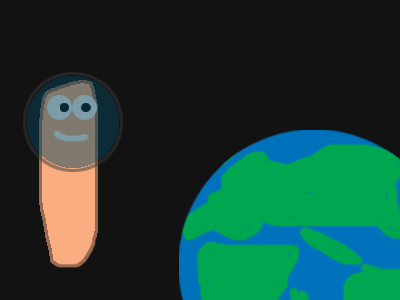

# Readme

[](https://creativecommons.org/licenses/by-sa/4.0/)

README was eaten by `VitalikLevin`.

- [The license text](/LICENSE.txt)

<picture>
  <source media="(prefers-color-scheme: dark)" srcset="files/images/spaceworm-dark.png">
  <source media="(prefers-color-scheme: light)" srcset="files/images/spaceworm.png">
  
</picture>

## Links
- [Main page](https://vitaliklevin.github.io/)
- [Our emoji pack](https://vitaliklevin.github.io/emoji/)
- [Our extensions](https://vitaliklevin.github.io/exts/)
  - [Steamy Fish](https://vitaliklevin.github.io/exts/steamyfish/)
    - [Steamy Fish Downloads](https://vitaliklevin.github.io/exts/steamyfish/downloads/)
- [Our games](https://vitaliklevin.github.io/games/)
  - [Bounce's Adventure](https://vitaliklevin.github.io/games/bsa/)
  - [Nature vs. Spirits](https://vitaliklevin.github.io/games/nves/)
    - [About Nature vs. Spirits](https://vitaliklevin.github.io/games/nves/about/)
    - [Nature vs. Spirits Downloads](https://vitaliklevin.github.io/games/nves/downloads/)
  - [Snake](https://vitaliklevin.github.io/games/snake/)
- _[Picture/video of the Month](https://vitaliklevin.github.io/picofmonth/)_
- [Our tools](https://vitaliklevin.github.io/tools/)
  - [`m3u-gen`](https://vitaliklevin.github.io/tools/m3u-gen/)
  - [`pls-gen`](https://vitaliklevin.github.io/tools/pls-gen/)
- [About site](https://vitaliklevin.github.io/about/)
  - [About VitalikLevin](https://vitaliklevin.github.io/about/vitaliklevin/)

## Local testing
1. Clone repository
2. Install `ruby` for your platform
3. Install gems `bundler` and `github-pages`
4. Run the snippet below to start web server

```
bundle exec jekyll serve
# Server URL: localhost:2804
```